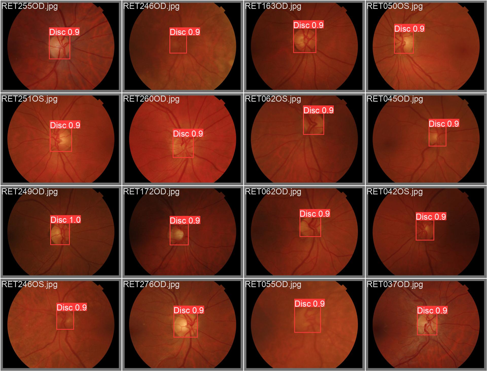

# YOLO v5: Custom Dataset Create Bounding Box From Masks


Put your dataset in folder 'Prepare dataset' and create folder to train and other to test.

The labels are saved in the same folder as the images.
- Train
  - img1.png
  - img2.png
  - ...
  - img1.txt
  - img2.txt
  - ...

### 1. Prepare dataset with bounding box
> run code PrepareData/Extract_bounding_box_from_masks to create bounding box 


### 2. Download YOLO v5
```ruby
! git clone  https://github.com/ultralytics/yolov5.git
```

### 3. Create file **data.yaml** in folder yolov5
```ruby
train: REFEUGE/train # caminho dos dados de treino 
val: REFUGE/test # caminho dos dados de teste 
nc: 1 
names: ['disc']  
```

### 4. Train yolo (file train.py)
```ruby
python train.py --data data.yaml --weights yolov5s.pt --img 640 --batch-size 8 --name Model_refuge --epochs 60
```

### 5. Export modelo onnx
```ruby
python export.py --weights runs/train/Model/weights/best.pt --include onnx --simplify --opset 12
```

### 6. Result

| Result YOLO v5 localized disc optic     |
|-----------------------------------------|
|  Predict localized disc optic using YOLO v5 in image|


